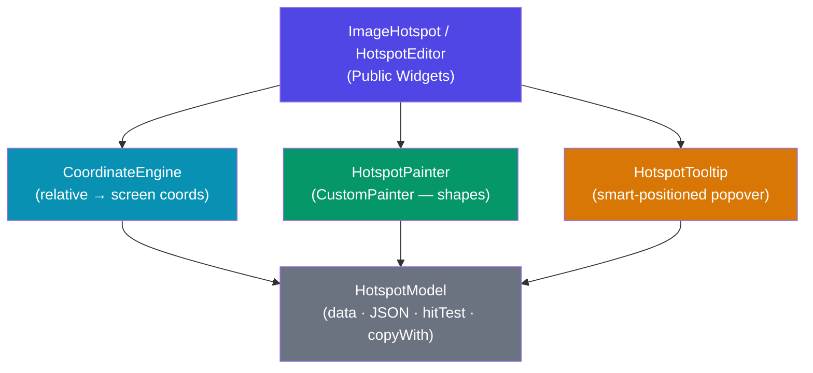

<div align="center">

# 🖼️ image_hotspot

### Add interactive, responsive hotspots to any Flutter image — in minutes.

[](https://pub.dev/packages/image_hotspot)
[](https://flutter.dev)
[](LICENSE)
[](https://flutter.dev)

</div>

---

## 👀 See It In Action

> **Four demo tabs — all from one package**

```
┌─────────────────────────────────────────────────────────────────────────────┐
│  Image Hotspot Demo                          [Viewer] [Zoom] [JSON] [Editor]│
├─────────────────────────────────────────────────────────────────────────────┤
│                                                                             │
│   ┌──────────────────────────────────────────────────────┐                 │
│   │                                                      │                 │
│   │      ●  Circle hotspot                               │                 │
│   │    (tap → tooltip pops up above)                     │                 │
│   │                                                      │                 │
│   │              ┌──────────┐                            │                 │
│   │              │Rectangle │  ← Custom widget tooltip   │                 │
│   │              └──────────┘                            │                 │
│   │                                                      │                 │
│   │                              ★  Icon hotspot         │                 │
│   │                                                      │                 │
│   │        ╱‾‾‾╲                                         │                 │
│   │       ╱ Poly╲  ← Arbitrary polygon shape             │                 │
│   │      ╱_______╲                                       │                 │
│   └──────────────────────────────────────────────────────┘                 │
│                                                                             │
└─────────────────────────────────────────────────────────────────────────────┘
```

| Tab | What you see |
|-----|-------------|
| **Viewer** | Mixed shapes (circle, rect, polygon, icon) with smart tooltips |
| **Zoom** | Same hotspots — pinch to zoom, hotspots stay aligned |
| **JSON** | Hotspots loaded from a JSON payload at runtime |
| **Editor** | Tap to add · drag to move · tap+delete to remove |

---

## 🧠 Problem → Solution

```
BEFORE  ──────────────────────────────────────────────────────
  Hotspot(x: 90, y: 60)  ← absolute pixels
  ↳ On a different screen? Hotspot is in the wrong place ❌
  ↳ Image resized? Hotspot drifts ❌
  ↳ BoxFit.contain? Letterbox not accounted for ❌

AFTER   ──────────────────────────────────────────────────────
  HotspotModel(dx: 0.45, dy: 0.30)  ← relative (0.0–1.0)
  ↳ Any screen size? Always correct ✅
  ↳ Any BoxFit? CoordinateEngine handles it ✅
  ↳ Zoom & pan? Hotspots scale with the image ✅
```

---

## 🏗️ Architecture



```
┌──────────────────────────────────────────────────────────────────┐
│  User code                                                       │
│  ─────────────────────────────────────────────────────────────  │
│  ImageHotspot(imagePath: '...', hotspots: [...])                 │
│       │                                                          │
│       ▼                                                          │
│  LayoutBuilder                                                   │
│       │                                                          │
│       ├──▶ CoordinateEngine ──▶ maps (dx,dy) → screen Offset     │
│       │         └──▶ handles BoxFit.cover / contain / fill       │
│       │                                                          │
│       ├──▶ RepaintBoundary                                       │
│       │       └──▶ Image (asset / network / file)                │
│       │                                                          │
│       ├──▶ RepaintBoundary                                       │
│       │       └──▶ CustomPaint (HotspotPainter)                  │
│       │               └──▶ circle / rectangle / polygon          │
│       │                                                          │
│       └──▶ GestureDetector + MouseRegion (per hotspot)           │
│               └──▶ HotspotTooltip (above/below/left/right)       │
└──────────────────────────────────────────────────────────────────┘
```

---

## ⚡ Key Features

### 🎯 Responsive Coordinates
Hotspots use **relative values (0.0 – 1.0)**, not pixels. They work correctly on any screen, any resolution, any `BoxFit`.

```dart
HotspotModel(dx: 0.5, dy: 0.3)  // always 50% from left, 30% from top
```

---

### 🔷 Three Shape Types

```
  ●  circle       ■  rectangle       ⬡  polygon
  radius: 0.05    width/height       List<Offset> points
                  as fractions
```

```dart
// circle — default
HotspotModel(dx: 0.2, dy: 0.3, radius: 0.05)

// rectangle
HotspotModel(dx: 0.5, dy: 0.5, shape: HotspotShape.rectangle,
             width: 0.15, height: 0.10)

// polygon — any number of vertices
HotspotModel(dx: 0.7, dy: 0.7, shape: HotspotShape.polygon,
             points: [Offset(0.60, 0.60), Offset(0.80, 0.60),
                      Offset(0.85, 0.80), Offset(0.55, 0.80)])
```

---

### 💬 Smart Tooltips
Popovers auto-position to stay within the image boundary. Works with plain text **or** any Flutter widget.

```
 ┌──────────────────────┐
 │  ℹ️  Custom tooltip  │  ← floats above, below, left, or right
 │  with any widget     │     — never clips out of view
 └──────────┬───────────┘
            │
           [●] hotspot
```

```dart
// plain text
HotspotModel(dx: 0.4, dy: 0.6, tooltip: 'Paris, France')

// custom widget
HotspotModel(dx: 0.4, dy: 0.6,
  tooltipWidget: Row(children: [
    Icon(Icons.place, color: Colors.white),
    Text('Paris, France', style: TextStyle(color: Colors.white)),
  ]))
```

---

### 🔍 Zoom & Pan
Wrap the widget in an `InteractiveViewer` with one flag — hotspots remain perfectly aligned at every zoom level.

```dart
ImageHotspot(
  imagePath: 'assets/map.jpg',
  enableZoom: true,   // ← that's it
  minScale: 0.5,
  maxScale: 5.0,
  hotspots: [...],
)
```

---

### 📦 JSON-Driven
Load hotspots from any API or local file. Full round-trip serialisation.

```json
{ "dx": 0.45, "dy": 0.30, "shape": "circle", "radius": 0.05,
  "color": 4280391411, "tooltip": "Paris", "id": "paris" }
```

```dart
final hotspots = (jsonList as List)
    .map((e) => HotspotModel.fromJson(e as Map<String, dynamic>))
    .toList();
```

---

### 🖊️ Built-in Editor

```
  ┌─────────────────────────────────┐
  │  ┌───────────────────────┐  [✕] │  ← selected hotspot gets delete btn
  │  │      Image            │      │
  │  │   ●──────────┐        │      │
  │  │   │ drag me  │        │      │
  │  │   └──────────┘        │      │
  │  │                       │      │
  │  │  tap anywhere → adds  │      │
  │  └───────────────────────┘      │
  └─────────────────────────────────┘
```

```dart
HotspotEditor(
  imagePath: 'assets/map.jpg',
  initialHotspots: [],
  onHotspotsChanged: (list) => setState(() => _hotspots = list),
)
```

| Gesture | Action |
|---|---|
| Tap empty area | Add hotspot |
| Drag hotspot | Reposition |
| Tap hotspot | Select (shows ✕) |
| Tap ✕ | Delete |

---

### 🖱️ Rich Interactions

```dart
HotspotModel(
  dx: 0.4, dy: 0.6,
  onTap:       () => print('tapped'),
  onLongPress: () => print('long-pressed'),
  onHover:     (isEntering) => print(isEntering ? 'in' : 'out'), // web/desktop
)
```

---

## 🚀 Installation

```yaml
# pubspec.yaml
dependencies:
  image_hotspot: ^0.2.0
```

```dart
import 'package:image_hotspot/image_hotspot.dart';
```

---

## 📖 Complete API Reference

### `ImageHotspot`

| Parameter | Type | Default | Description |
|---|---|---|---|
| `imagePath` | `String?` | — | Asset path (or use `imageProvider`) |
| `imageProvider` | `ImageProvider?` | — | Network / file / memory image |
| `hotspots` | `List<HotspotModel>` | required | The hotspots to render |
| `imageFit` | `BoxFit` | `cover` | How the image fills its box |
| `imageWidth` | `double` | `∞` | Widget width constraint |
| `imageHeight` | `double` | `∞` | Widget height constraint |
| `showTooltip` | `bool` | `true` | Enable/disable tooltip popovers |
| `imageAspectRatio` | `double?` | `null` | Width÷height for letterbox compensation |
| `enableZoom` | `bool` | `false` | Wrap in `InteractiveViewer` |
| `minScale` | `double` | `0.5` | Minimum zoom scale |
| `maxScale` | `double` | `4.0` | Maximum zoom scale |

### `HotspotModel`

| Parameter | Type | Default | Description |
|---|---|---|---|
| `dx` | `double` | required | Relative X position (0.0–1.0) |
| `dy` | `double` | required | Relative Y position (0.0–1.0) |
| `shape` | `HotspotShape` | `circle` | `circle`, `rectangle`, or `polygon` |
| `radius` | `double` | `0.05` | Circle radius as fraction of image width |
| `width` | `double` | `0.1` | Rectangle width fraction |
| `height` | `double` | `0.1` | Rectangle height fraction |
| `points` | `List<Offset>` | `[]` | Polygon vertices (relative) |
| `color` | `Color` | `blue` | Shape fill / border colour |
| `icon` | `Widget?` | `null` | Custom marker widget (replaces shape) |
| `tooltip` | `String?` | `null` | Plain-text popover |
| `tooltipWidget` | `Widget?` | `null` | Custom popover widget |
| `onTap` | `VoidCallback?` | `null` | Tap handler |
| `onLongPress` | `VoidCallback?` | `null` | Long-press handler |
| `onHover` | `ValueChanged<bool>?` | `null` | Hover handler (web/desktop) |
| `id` | `String?` | `null` | Optional identifier for JSON / editor |
| `metadata` | `Map?` | `null` | Arbitrary extra data |

---

## 🔀 Migrating from 0.1.x

| 0.1.x | 0.2.x |
|---|---|
| `Hotspot(x: 90, y: 60)` | `HotspotModel(dx: 0.45, dy: 0.30)` — relative coords |
| `size: 30` (pixels) | `radius: 0.05` (fraction of image width) |
| `imagePath: 'path'` | unchanged |

> **Why the change?** Absolute pixels break on different screen sizes. Relative coordinates (0.0–1.0) work everywhere.

---

## 📂 Project Structure

```
lib/
├── image_hotspot.dart          ← single import for consumers
└── src/
    ├── models/
    │   └── hotspot_model.dart  ← HotspotModel, HotspotShape, legacy Hotspot
    ├── engine/
    │   └── coordinate_engine.dart  ← relative ↔ screen coord mapping
    ├── widgets/
    │   ├── image_hotspot_widget.dart  ← main ImageHotspot widget
    │   ├── hotspot_painter.dart       ← CustomPainter for shapes
    │   └── hotspot_tooltip.dart       ← smart-positioned popover
    └── editor/
        └── hotspot_editor.dart  ← drag-and-drop hotspot editor
```

---

## 📄 License

MIT — see the [LICENSE](LICENSE) file for details.

